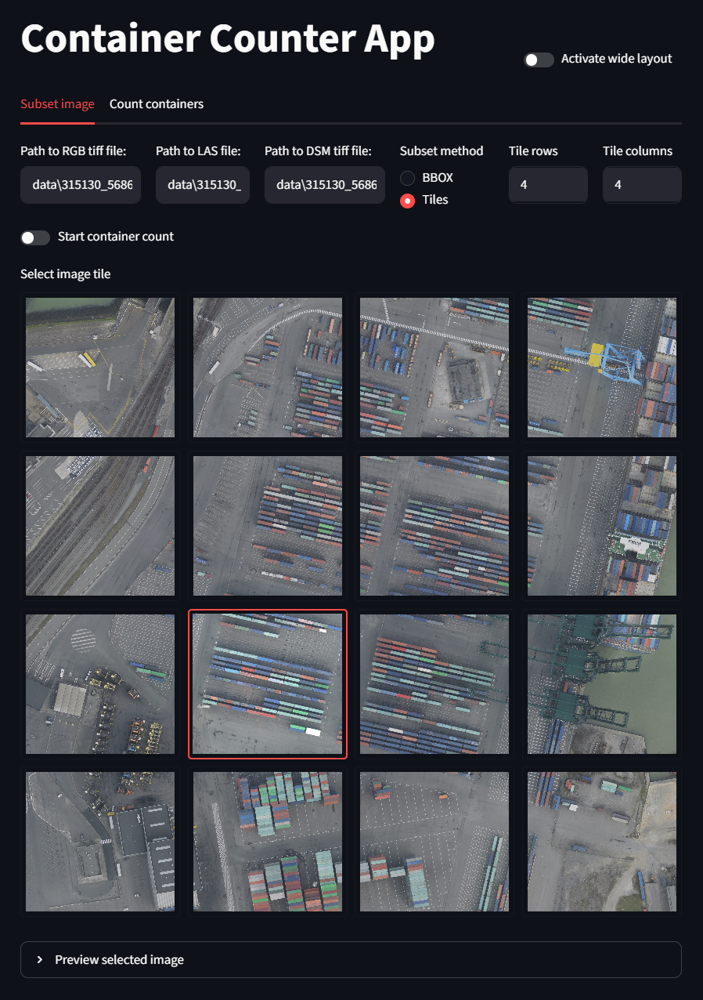
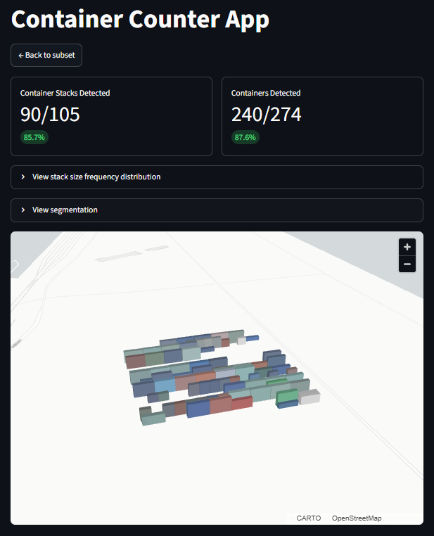

# Container Counter App

A Streamlit web application for estimating the number of shipping containers in high-resolution aerial imagery using image tiling, Segment Anything Model segmentation, LiDAR point-cloud elevation information, and DSM raster elevation statistics.

The app allows a user to:

* Load an RGB GeoTIFF image
* Load a corresponding LAS point cloud
* Load a corresponding DSM GeoTIFF
* Subset a large image using image tiles
* Segment likely container stacks using Segment Anything
* Estimate stack heights using LiDAR and DSM elevation information
* Estimate the number of containers in each stack
* View segmentation results and a 3D visualisation of detected container stacks

## App Preview

The app has two main tabs:

1. **Subset image**
   Used to select the input RGB TIFF, LAS file, DSM TIFF, and image tile.
   
   
3. **Count containers**
   Used to run segmentation, calculate elevation-based container counts, and visualise the results.
   

## Project Structure

```text
.
├── app.py
├── scripts/
│   ├── subset_image.py
│   └── count_containers.py
├── models/
│   └── sam_vit_b_01ec64.pth
├── requirements.txt
├── README.md
└── .gitignore
```

## Required Input Data

The app expects three input files:

```text
RGB GeoTIFF image: .tif or .tiff
LAS point cloud:   .las
DSM GeoTIFF:       .tif or .tiff
```

The RGB image, LAS point cloud, and DSM should cover the same area and should ideally be in the same coordinate reference system.

## How It Works

### 1. Image tiling

Large aerial GeoTIFFs are impractical to process in one pass. The app converts the RGB TIFF to a JPEG preview and divides it into a configurable grid of tiles. The user selects one tile, and its pixel coordinates are mapped back to the original TIFF's geospatial reference frame using rasterio's `Window` and `window_bounds`  giving an exact bounding box in the image's CRS for all downstream steps.

### 2. Segmentation with SAM

The selected tile is passed to the Segment Anything Model (ViT-B), running in automatic mask generation mode. Rather than requiring manual prompts, SAM samples a dense grid of points across the image (`points_per_side=32`) and generates candidate segmentation masks for every distinct region it finds. Each mask is filtered by predicted IOU (≥ 0.80), stability score (≥ 0.80), and minimum region area (≥ 500 px) to discard noise and poorly-defined segments.

SAM is well-suited to this task because it generalises to arbitrary shapes without domain-specific fine-tuning shipping containers form visually distinct rectangular regions in aerial imagery that the model segments reliably.

### 3. Converting masks to georeferenced polygons

Each binary mask is converted to a contour using OpenCV, and `cv2.minAreaRect` fits a tight rotated bounding box around it. Rotated boxes are used rather than axis-aligned boxes because containers are rarely perfectly north-aligned in aerial imagery.

The four corner points of each box are then converted from pixel coordinates to real-world coordinates using the tile's affine transform, producing a GeoJSON polygon collection in EPSG:32631 with per-polygon area and aspect ratio attributes.

### 4. Enriching polygons with elevation data

Two elevation sources are used together because they capture different things:

- **LiDAR (LAS)**: The point cloud is filtered to the tile's bounding box, and a spatial join assigns each LiDAR return to the polygon it falls within. Per-polygon statistics are computed including mean, median, max, and standard deviation of the Z values.
- **DSM (Digital Surface Model)**: Zonal statistics from the DSM raster give the local ground elevation directly beneath each polygon, used as the reference elevation for height calculations.

### 5. Estimating container counts

Stack height is calculated as:
elev = mean_z (LiDAR) − dsm_mean (DSM)

The number of containers in a stack is estimated by dividing `elev` by the standard container height of approximately 2.6 metres.

### 6. 3D visualisation

The final GeoDataFrame is reprojected to WGS84 and rendered as an extruded `PolygonLayer` in pydeck. Each polygon is extruded to its calculated stack height, and the fill colour is sampled directly from the mean RGB value of the corresponding pixels in the source image so containers appear in their actual colours.

---


## Segment Anything Model Checkpoint

This app uses the [Segment Anything](https://github.com/facebookresearch/segment-anything/tree/main) ViT-B checkpoint: [ViT-B SAM model.](https://dl.fbaipublicfiles.com/segment_anything/sam_vit_b_01ec64.pth)

The model checkpoint is not included in this repository because it is a large file.

Download the checkpoint from [here](https://dl.fbaipublicfiles.com/segment_anything/sam_vit_b_01ec64.pth), then place it in the `models/` folder so that the final path is:

```text
models/sam_vit_b_01ec64.pth
```

Make sure the filename matches exactly.

### What SAM does and does not know

SAM has no concept of what a shipping container is. It segments regions based purely on visual boundaries contrast, texture, and edge information without any semantic understanding. This is both a strength and a limitation. It means SAM generalises well to aerial imagery without retraining, but it also means it will confidently segment shadows, road markings, and rooftops alongside containers. The elevation-based filtering steps downstream do the semantic heavy lifting of deciding which segments are actually containers.

---

## Filtering and Assumptions

Several filtering steps and fixed assumptions are applied during the container counting process. These are currently hardcoded and were tuned for the original dataset. If you are applying the app to a different site, these are the values most likely to need adjustment.

### Segmentation filters

| Parameter | Value | Purpose |
|---|---|---|
| `pred_iou_thresh` | 0.80 | Removes masks where SAM has low confidence in boundary quality |
| `stability_score_thresh` | 0.80 | Removes masks that are inconsistent across threshold perturbations |
| `min_mask_region_area` | 500 px | Removes very small segments likely to be noise |

### Elevation filters

After elevation statistics are added, a second round of filtering removes non-container detections:

- **`std_z < 5`** - removes polygons with high vertical variance within their footprint, typically narrow tall structures such as floodlight poles rather than flat-topped container stacks.
- **`mean_z > 51`** - removes ground-level detections by requiring a minimum absolute elevation. This value reflects the site's ground elevation and will need to be updated for different locations.
- **`area_px` between 2,000 and 15,000** - removes segments that are too small (noise) or too large (buildings, open ground) to plausibly be individual container stacks.
- **`elev > 3`** -  removes any polygon whose calculated above-ground height is less than 3 metres, filtering out detections sitting at or near ground level.

### Platform correction

At some sites, containers are stacked on elevated platforms or plinths. Where calculated stack height exceeds 18 metres, 16 metres is subtracted from the elevation and stored separately as `base_height`. This offset is used to set the base elevation of the extruded polygon in the 3D visualisation, so the stack appears to sit on its platform rather than floating at ground level.


## Installation

### 1. Clone the repository

```bash
git clone https://github.com/YOUR-USERNAME/container-counter-app.git
cd container-counter-app
```

### 2. Create a Conda environment

```bash
conda create -n container-counter python=3.11 -y
```

Activate the environment:

```bash
conda activate container-counter
```

### 3. Install dependencies

Install the required Python packages:

```bash
pip install -r requirements.txt
```

Depending on your operating system, some geospatial libraries may install more reliably through Conda. If `rasterio`, `geopandas`, or related packages fail with `pip`, try:

```bash
conda install -c conda-forge rasterio geopandas shapely fiona pyproj -y
pip install -r requirements.txt
```

## Running the App

From the project root folder, run:

```bash
streamlit run app.py
```

This will start the Streamlit app and open it in your browser.

If it does not open automatically, copy the local URL shown in the terminal, usually something like:

```text
http://localhost:8501
```

## How to Use the App

### Step 1: Open the app

Run:

```bash
streamlit run app.py
```

### Step 2: Provide input file paths

In the **Subset image** tab, enter paths to:

```text
RGB TIFF file
LAS file
DSM TIFF file
```

Example:

```text
data/rgb_image.tif
data/point_cloud.las
data/dsm.tif
```

### Step 3: Choose the subset method

Currently, the main available subset method is:

```text
Tiles
```

The app converts the RGB TIFF into a JPEG preview, divides it into rows and columns, and allows the user to select one tile.

### Step 4: Set tile rows and columns

Choose the number of tile rows and tile columns.

For example:

```text
Tile rows:    4
Tile columns: 4
```

The app will generate image tiles and display them in a selectable grid.

### Step 5: Select an image tile

Click one of the displayed tiles.

The selected tile is mapped back to the original TIFF pixel coordinates using metadata generated during tiling.

### Step 6: Start container counting

Activate:

```text
Start container count
```

Then go to the **Count containers** tab.

The app will:

1. Generate segmentation masks using Segment Anything
2. Convert masks to rotated bounding boxes
3. Convert bounding boxes to GeoJSON polygons
4. Filter the LAS point cloud to the selected image bounds
5. Crop the DSM to the same selected image bounds
6. Add LiDAR and DSM elevation statistics to each detected polygon
7. Estimate the number of container stacks and containers
8. Display a 3D visualisation

## Outputs

The app writes temporary and generated outputs to the `outputs/` folder.

Typical generated outputs include:

```text
outputs/preview_image.jpg
outputs/preview_tiles/
outputs/preview_tiles/user_cropped_aoi_image.tif
outputs/preview_tiles/container_segements.geojson
outputs/preview_tiles/filtered_las.las
outputs/preview_tiles/cropped_dsm.tif
```

These outputs are generated automatically when the app runs.

## Important Notes

### Coordinate Reference System

The RGB TIFF, DSM TIFF, and LAS point cloud should be in the same coordinate reference system. If they are not, the point-cloud filtering and DSM-based elevation statistics may not align correctly with the selected image tile.

### Model Checkpoint

The app expects the [SAM checkpoint](https://dl.fbaipublicfiles.com/segment_anything/sam_vit_b_01ec64.pth) at:

```text
models/sam_vit_b_01ec64.pth
```

If the checkpoint is missing, the segmentation step will fail.

### GPU Support

The app uses PyTorch and Segment Anything. If CUDA is available, the model can run on GPU. If CUDA is not available, it will run on CPU, but segmentation may be slower.

## Current Limitations

* The BBOX subset option is not yet implemented.
* The app currently relies on file paths entered by the user rather than file upload widgets.
* Results depend on the quality and alignment of the RGB TIFF, LAS point cloud, and DSM.
* The container count estimate assumes a standard container height of approximately 2.6 metres.
* Some filtering thresholds are currently hard-coded and adjustments are not yer implemented for different sites or datasets.

## Future Improvements

* Implementing the BBOX drawing workflow
* Adding CRS validation between RGB TIFF, DSM, and LAS inputs
* Adding user controls for container height and filtering thresholds
* Saving final results as GeoJSON, CSV, or GeoPackage
* A download button for outputs
* Better error messages when files are missing or misaligned

## License

```text
MIT License
```

## Author

Developed by Mary Muthee, Pedro Alfonso and Jedidiah Chibinga.
